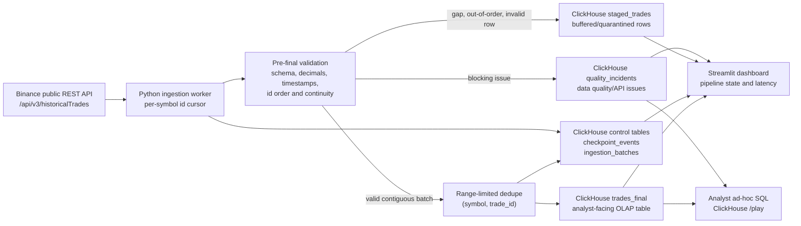

# Binance Trade Data Pipeline

Self-contained Binance raw trade pipeline for `BTCUSDT` and `ETHUSDT`.

## Architecture

- **Worker**: polls unauthenticated Binance raw trades with `GET /api/v3/historicalTrades?symbol=<symbol>&fromId=<next_expected_id>&limit=1000`.
- **ClickHouse**: stores final OLAP trades plus checkpoint, batch, staging, and quality incident tables.
- **Streamlit**: shows row counts, final id ranges, freshness, min/avg/max final latency, buffered rows, and quality incidents.

The final table only advances as a contiguous id sequence per symbol. If the worker expects trade id `5001` but receives `5002`, later rows are staged and final promotion for that symbol stalls until the missing id is available.

### Data-flow design



The worker has one durable cursor per symbol. It asks Binance for the exact next expected trade id, validates that the response starts there and increments by one, inserts only missing final rows in that id range, and advances the checkpoint only after the final insert and batch audit succeed.

## Run

```bash
docker compose up --build
```

Dashboard: <http://localhost:8501>

ClickHouse HTTP: <http://localhost:8123>

ClickHouse SQL playground: <http://localhost:8123/play?database=binance>

Credentials:

- user: `default`
- password: `binance`
- database: `binance`

## Ad-hoc queries

Open <http://localhost:8123/play?database=binance> and run SQL directly against the `binance` database.

Example queries:

```sql
SELECT *
FROM trades_final
ORDER BY trade_time DESC
LIMIT 20;
```

```sql
SELECT
    symbol,
    count() AS rows,
    min(trade_time) AS first_trade_time,
    max(trade_time) AS latest_trade_time,
    min(trade_id) AS min_trade_id,
    max(trade_id) AS max_trade_id
FROM trades_final
GROUP BY symbol
ORDER BY symbol;
```

```sql
SELECT *
FROM quality_incidents
ORDER BY created_at DESC
LIMIT 50;
```

## Correctness model

- Final table key: `(symbol, trade_id)`.
- Source cursor: `next_expected_trade_id` per symbol.
- Steady-state request: `historicalTrades` with `fromId=<next_expected_trade_id>` and `limit=1000`.
- Polling interval: 5 seconds per symbol while healthy.
- If a full batch is returned, the worker immediately polls again to catch up.
- Binance `429` responses are respected using `Retry-After`; without that header, the worker waits 5 seconds.
- Binance-side indexing is treated as close to live but not zero-lag. Missing next ids are retried within a configurable grace window before a critical incident is raised.

## Dedupe

The worker is intentionally single-writer. Before inserting a validated batch, it queries `trades_final` only for the current symbol and id range, filters existing ids, inserts missing rows, records the batch, and only then appends the next checkpoint event.

This makes retries safe:

- Crash before insert: checkpoint has not advanced, so the same batch is retried.
- Crash after insert but before checkpoint: same batch is retried, existing ids are filtered out, then the checkpoint advances.

## Data quality checks

Rows are promoted only if:

- required Binance fields are present;
- ids start at the expected id and increment by exactly 1;
- price and quantity are positive decimals;
- quote quantity is nonnegative;
- timestamp is parseable and not more than 5 minutes in the future;
- boolean fields are actually booleans.

Late/out-of-order statistics come from staged/quarantined rows and incidents, not from polluted final rows.

## Configuration

Environment variables:

- `SYMBOLS`: comma-separated symbols, default `BTCUSDT,ETHUSDT`
- `BINANCE_BASE_URL`: default `https://api.binance.com`
- `CLICKHOUSE_HOST`: default `localhost`
- `CLICKHOUSE_PORT`: default `8123`
- `CLICKHOUSE_DATABASE`: default `binance`
- `CLICKHOUSE_USER`: default `default`
- `CLICKHOUSE_PASSWORD`: default `binance`
- `POLL_INTERVAL_SECONDS`: default `5`
- `GAP_GRACE_SECONDS`: default `180`
- `BINANCE_LIMIT`: default `1000`

## Tests

```bash
python -m venv .venv
. .venv/bin/activate
pip install -r requirements-dev.txt
PYTHONPATH=src pytest
```
